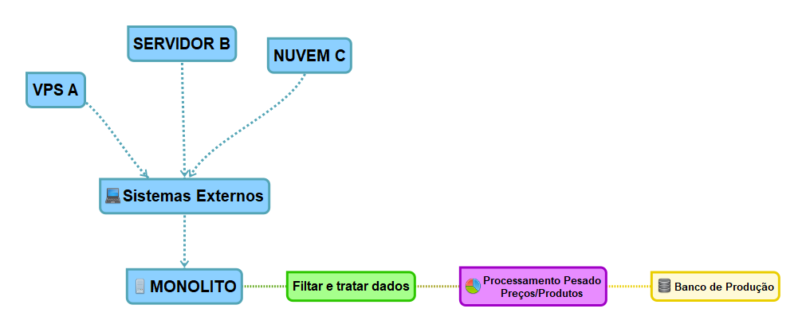
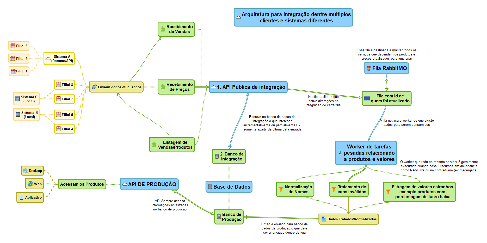

> Sem delongas neste post abordo como idealizei a integração dentre sistemas
> legados com um sistema distribuído e facilmente.

Nesse breve post pretendo descrever como arquitetei uma integração entre múltiplos sistemas **legados centralizados/distribuidos** (Servidor local e servidor em nuvem) de ERPs com uma API principal em um VPS sem recursos abundantes .

## A proposta/Cenário

O cenário consistia de:

VPS pequeno rodando :

- Monolito em NodeJS
- Serviços relacionados ao sistema
- Banco de dados - Uma instância em MariaDB

No lado de fora havia múltiplos sistemas cada um com seu modo operantis:

- Sistemas em delphi
- Banco de dados locais em Firebird
- APIs em nuvem

Após possuir os dados seria necessário mais um passo:

- Processamento pesado em vendas passadas para regras em cima da precificação.
- Processamento de produtos como nome, código de barras, para verificação se é um produto válido (com nome e descrição corretos).

## O desafio.

No momento o desafio era claro e era basicamente receber no sistema principal os dados de produtos e vendas para processamento posterior sendo provavelmente em um fila ou algo do gênero para ser consumida ao longo do dia.

## Solução proposta

Para resolver o problema de forma rápida e auto sustentável criei a seguinte solução.

Composta dos seguintes componentes:

### 1 - API Rest ambígua entre sistemas

Ambígua pois ela recebe os dados de todos os sistemas portando simplesmente de um token de API que possui os dados do respectivo sistema que esta enviando os dados e com isso normalizando os dados independente de sua origem.

### 2 - Banco de Integração para armazenamento dos dados abstraídos.

Para todas integrações que enviarem dados pela API Rest terão os dados de produtos e vendas sendo armazenados em um banco de integração com todas informações de produtos sendo agrupadas por cada filial e .

### 3 - Fila de processamento (Para processamento pesado baseado na carga do vps)

Para não sobrecarregar o servidor principal processando múltiplos dados em paralelo recém recebidos, criando overhead em memória pois o processamento tem de subir as vendas na memória.

### 4 - Serviço/Worker Separado para processamento de dados após recebimento.

Serviço isolado muito bem definido com testes automatizados de 90% e tudo que regras de negócios precisam para funcionar corretamente, e que terá a finalidade de consumir a fila de processamento, quando uma filial necessitar de processamento. Assim então se fazem os cálculos de preços e sorting dos dados e então é enviado para produção ou para uma outra fila, seja para copyrighters finalizarem validações de nomes ou para o marketing alterar/tratar fotos.

### Finalizando o ciclo

Após todos esses procedimentos os dados são enviados pelo worker para o banco de produção no qual ficam disponiveis para acesso por outros serviços do sistema principal da aplicação.

Por fim essa foi a arquitetura que até o momento desse post é utilizada, e com isso tem conseguido escalar com todos os produtos.

Mapa mental dos componentes da arquitetura no seu modelo atual, obviamente passível de melhorias.

Em breve escreverei um pouco sobre aplicações de mapa mental, no momento desse artigo utilizei o aplicativo SimpleMind na sua versão mobile para mim melhor custo benefício em mapas mentais no Android.
